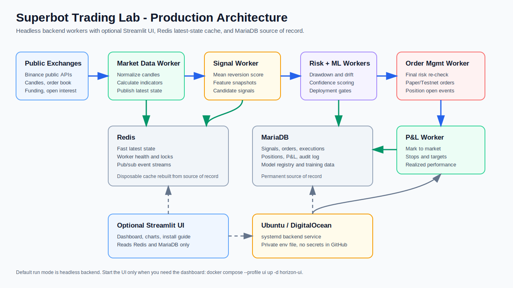

# Superbot Trading Lab

Superbot is a testnet-first trading lab. In plain English, it watches crypto market data, looks for short-term mean-reversion opportunities, checks whether each idea is safe enough to test, learns from trade outcomes, and records every important action.

The web dashboard is optional. The backend can run headless on an Ubuntu droplet through systemd workers, while the UI simply renders status, signals, charts, audit events, and install guidance.



## Quick Ubuntu Install

Use Ubuntu `24.04 LTS` for production. Keep real secrets out of GitHub.

```bash
sudo apt-get update
sudo apt-get install -y git

git clone https://github.com/kaniampurath/superbot.git /home/myts/superbot
cd /home/myts/superbot

cp .env.production.example horizon-prod.env
nano horizon-prod.env
chmod 600 horizon-prod.env

bash scripts/install_ubuntu.sh --check --app-dir /home/myts/superbot --app-user myts --env-file horizon-prod.env
sudo bash scripts/install_ubuntu.sh --app-dir /home/myts/superbot --app-user myts --env-file horizon-prod.env

sudo systemctl start horizon-backend
sudo systemctl start horizon-ui
bash scripts/healthcheck_ubuntu.sh
bash scripts/horizonctl.sh performance
```

## Required Config

| Setting | Purpose | Required |
|---|---|---|
| `MYSQL_PASSWORD` | Database password for the app user | Yes |
| `MYSQL_ROOT_PASSWORD` | MariaDB root password | Yes |
| `ENABLE_REAL_TESTNET_ORDERS` | Set `false` until Testnet credentials are ready | Yes |
| `testnet_key` / `testnet_secret` | Binance Spot Testnet credentials | Only when Testnet orders are enabled |
| `UI_HOST_PORT` | External Streamlit port, for example `8502` when `8501` is busy | No |

The installer checks the existing setup before installing: app directory, git checkout, env file, systemd services, Docker daemon, existing Compose services, and the configured `UI_HOST_PORT`.

## What Runs Headless

The default backend stack starts MariaDB, Redis, market data, signal, risk, ML, order management, and P&L workers. The Streamlit UI is separate and optional.

```bash
docker compose -f docker-compose.prod.yml --env-file .env up -d --build
docker compose -f docker-compose.prod.yml --env-file .env --profile ui up -d horizon-ui
```

## See Performance

From Ubuntu CLI:

```bash
bash scripts/horizonctl.sh performance
bash scripts/horizonctl.sh performance-json
```

From the UI, open the Streamlit dashboard and switch to `Trading Dashboard`.

For the full operational runbook, see [README_RUN.md](README_RUN.md).
