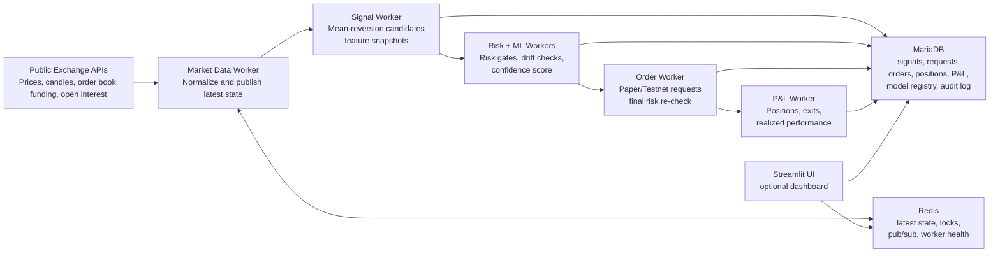

# Horizon Institutional Lab

## Superbot Trading Lab

Superbot is a testnet-first trading lab. In plain English, it watches crypto market data, looks for short-term mean-reversion opportunities, checks whether each idea is safe enough to test, learns from trade outcomes, and records every important action.

The web dashboard is optional. The backend can run headless on an Ubuntu droplet through systemd workers, while the UI simply renders status, signals, charts, audit events, and install guidance.



## Quick Ubuntu Install

Use Ubuntu `24.04 LTS` for production. Keep real secrets out of GitHub.

```bash
sudo apt-get update
sudo apt-get install -y git

git clone https://github.com/kaniampurath/superbot.git /home/myts/superbot
cd /home/myts/superbot

cp .env.production.example horizon-prod.env
nano horizon-prod.env
chmod 600 horizon-prod.env

bash scripts/install_ubuntu.sh --check --app-dir /home/myts/superbot --app-user myts --env-file horizon-prod.env
sudo bash scripts/install_ubuntu.sh --app-dir /home/myts/superbot --app-user myts --env-file horizon-prod.env

sudo systemctl start horizon-backend
sudo systemctl start horizon-ui
bash scripts/healthcheck_ubuntu.sh
```

Minimum env values:

| Setting | Purpose | Required |
|---|---|---|
| `MYSQL_PASSWORD` | Database password for the app user | Yes |
| `MYSQL_ROOT_PASSWORD` | MariaDB root password | Yes |
| `ENABLE_REAL_TESTNET_ORDERS` | Set `false` until Testnet credentials are ready | Yes |
| `testnet_key` / `testnet_secret` | Binance Spot Testnet credentials | Only when Testnet orders are enabled |

## What This System Is
`horizon_institutional_lab` is a local crypto mispricing feasibility and validation lab. It combines Binance public market data, a composite alpha model, risk gates, paper deployment, audit logging, and a Streamlit institutional dashboard.

## What This System Is Not
It is not a guaranteed-profit bot, investment advice, or an unattended live trading system. Binance Spot Testnet orders are enabled by default only when testnet credentials are present, and training auto-approval is limited by risk, drift, validation, symbol, duplicate-position, ML-confidence, and max-size gates.

## Docker Run
```powershell
docker compose up --build
```

This starts the headless backend workers without the UI. To include the dashboard:

```powershell
docker compose --profile ui up --build
```

Open the UI only when the `ui` profile is enabled:

```text
http://localhost:8501
```

## Ubuntu / DigitalOcean Release
Use the production compose file and installer on an Ubuntu droplet:

```bash
git clone <repo-url> horizon-lab
cd horizon-lab
sudo cp .env.production.example /root/horizon-prod.env
sudo nano /root/horizon-prod.env
sudo chmod 600 /root/horizon-prod.env
sudo bash scripts/install_ubuntu.sh --check --env-file /root/horizon-prod.env
sudo bash scripts/install_ubuntu.sh --env-file /root/horizon-prod.env
sudo systemctl start horizon-backend
sudo systemctl start horizon-ui
cd /opt/horizon-lab
bash scripts/healthcheck_ubuntu.sh
```

Backend workers run headless through `horizon-backend.service`. The Streamlit UI is optional through `horizon-ui.service`; the system does not depend on the UI to ingest data, train ML, score signals, manage risk, queue orders, or track P&L.

Release artifacts:

| File | Purpose |
|---|---|
| `docker-compose.prod.yml` | Ubuntu production compose stack with MariaDB, Redis, backend workers, order worker, ML worker, and optional UI profile |
| `.env.production.example` | Placeholder-only production environment template; copy outside git and fill secrets on the droplet |
| `sql/init/001_schema.sql` | MariaDB first-boot schema and default strategy seed |
| `scripts/install_ubuntu.sh` | Complete Ubuntu installer with `--check` readiness mode and `--env-file` support for private droplet config |
| `scripts/healthcheck_ubuntu.sh` | Droplet health check for env, Docker, compose, Python compile, services, and optional UI |
| `systemd/horizon-backend.service` | Headless backend service |
| `systemd/horizon-ui.service` | Optional dashboard service |

## Prompt Utility
Use `horizonctl` from PowerShell or Command Prompt.

PowerShell:

```powershell
.\horizonctl.ps1 health
.\horizonctl.ps1 start-backend
.\horizonctl.ps1 start-ui
.\horizonctl.ps1 performance
.\horizonctl.ps1 performance-json
.\horizonctl.ps1 status
.\horizonctl.ps1 stop
```

Command Prompt:

```bat
horizonctl.bat health
horizonctl.bat start-backend
horizonctl.bat start-ui
horizonctl.bat performance
horizonctl.bat performance-json
horizonctl.bat status
horizonctl.bat stop
```

Actions:

| Action | Purpose |
|---|---|
| `health` | Compile check, Docker Compose validation, backend/UI profile check, credential presence check, current service status, and UI health probe |
| `start-backend` | Starts the headless backend only: MariaDB, Redis, market data, signal, risk, ML, order, and P&L workers |
| `start-ui` | Starts backend plus optional Streamlit UI using the `ui` profile |
| `local-ui` | Runs only the local Streamlit UI process from the prompt |
| `performance` | Prints equity, P&L, drawdown, risk, drift, worker status, orders, model metrics, and latest signals from backend state |
| `performance-json` | Prints the same report as JSON for scripts and monitoring |
| `status` | Shows Docker service state and UI health |
| `stop` | Stops backend and UI containers |

Ubuntu:

```bash
bash scripts/horizonctl.sh health
bash scripts/horizonctl.sh status
bash scripts/horizonctl.sh performance
bash scripts/horizonctl.sh performance-json
```

## Local Run
```powershell
pip install -r requirements.txt
streamlit run horizon_institutional_live_production_grade.py
```

The app runs without Binance credentials. If Redis or MariaDB are unavailable locally, the UI falls back to simulated latest state so the preview remains usable.

## Environment Variables
Copy `.env.example` and override values as needed. Secrets are read only from `testnet_key`, `testnet_secret`, or the documented uppercase fallbacks. Secrets are never printed.

## Paper Trading
Paper trading is enabled by default. Deployment requires a deployable signal, risk OK, green validation, and manual approval in the UI. The UI queues a durable `deployment_requests` row; `worker-order` owns the final risk re-check, paper order creation, execution record, position open, Redis `live_position:{symbol}` update, and audit event.

## Training Auto-Approval
`SYSTEM_STAGE=training`, `TRAINING_AUTO_APPROVE_PAPER=true`, and `AUTO_APPROVE_ORDER_MODE=TESTNET` allow `worker-signal` to queue small auto-approved Testnet deployment requests for candidate entries so the system can collect trade outcomes. Auto approval respects risk/drift, execution sanity, duplicate-position checks, ML confidence, symbol whitelist, and `TRAINING_AUTO_APPROVE_MAX_POSITION_USDT`. Switch `SYSTEM_STAGE=production` and `TRAINING_AUTO_APPROVE_PAPER=false` to restore the manual production-grade approval path.

## Mean-Reversion Strategy Defaults
The deployable strategy is short-term mean reversion on `STRATEGY_INTERVAL=15m`. Default gates are `abs(z) >= 2.7`, BUY only when `RSI <= 35`, SELL only when `RSI >= 65`, `volume_z >= -0.5`, taker-flow confirmation, low-trend regime with `ADX <= 22`, falling realized volatility, expected mean-reversion move at least `3x` round-trip cost, and order-book confirmation. A 4h trend guard blocks shorts in strong higher-timeframe uptrends and buys in strong higher-timeframe downtrends. Deployment requires green full and rolling validation: profit factor >= `1.2`, expectancy >= `5` bps, and max validation drawdown <= `8%`.

`MEAN_REVERSION_RESEARCH_ONLY=true` is the safety default after the October 2024 backtest failure. Set it to `false` only after a longer validation run passes the deployment gates.

## ML Confidence Layer
`worker-ml` builds labeled candidate events from historical candles, trains a dependency-free logistic confidence model, stores feature snapshots and outcomes, writes model versions to `model_registry`, and caches the active model in Redis. `worker-signal` writes live `feature_snapshots` and `ml_predictions`, then blocks deployment when `ML_CONFIDENCE_GATE_ENABLED=true` and `ml_confidence < MIN_ML_CONFIDENCE`.

The ML model is only an entry-confidence filter. It does not override research-only mode, validation, risk, drift, order-book, or manual approval gates.

Model promotion is governed. `worker-ml` combines fresh candle-derived labels with stored `feature_snapshots` + `trade_outcomes`, trains a candidate model, then promotes it only when it meets `ML_MIN_TRAINING_ROWS`, `ML_MIN_ACCURACY`, `ML_MIN_PRECISION`, `ML_MIN_RECALL`, and, when `ML_PROMOTE_ONLY_IF_BETTER=true`, beats the active model. Promoted models archive previous active versions; rejected candidates remain in `model_registry` with status `REJECTED`.

## Optional Testnet Mode
`ENABLE_REAL_TESTNET_ORDERS=true` is the default. Provide Binance Spot Testnet credentials and use tiny order sizes only. In production stage, Testnet deployment should remain manually approved unless you explicitly keep auto approval enabled.
In training mode, auto-approved Testnet orders require valid Spot Testnet credentials and are submitted only to `https://testnet.binance.vision`.

## MariaDB Usage
MariaDB is the source of record. Signals, deployment requests, order attempts, executions, positions, P&L snapshots, risk events, audit rows, validation runs, ML feature snapshots, ML predictions, model registry rows, trade outcomes, and worker heartbeats are persisted.

## Redis Usage
Redis stores latest state, pub-sub messages, worker health, and duplicate-prevention locks. Redis is disposable and rebuilt from MariaDB where practical. Important latest-state keys include `latest_price:{symbol}`, `latest_orderbook:{symbol}`, `latest_cross_exchange:{symbol}`, `latest_signal:{symbol}`, `live_position:{symbol}`, `live_pnl`, `risk_state`, `drift_state`, and `worker_status:{worker}`. Important channels include `market_ticks`, `orderbook_updates`, `signal_updates`, `pnl_updates`, `risk_events`, `audit_events`, and `audit_updates`.

## Position Lifecycle
The order worker opens paper positions after manual approval and final gate checks. The P&L worker marks positions to market and closes paper positions on stop-loss hit, take-profit hit, or risk-lock exit. Every close writes an execution, updates the position, publishes audit events, and persists an immutable audit row.

## Scaling Workers
```powershell
docker compose up --scale worker-marketdata=3
docker compose up --scale worker-signal=2
docker compose up --scale worker-order=2
```

Redis locks and MariaDB unique idempotency keys prevent duplicate signal, deployment, and order records.

## Safety Warnings
Use paper mode for validation. Check data quality, stale prices, spread/slippage, drawdown, drift, and execution assumptions before any deployment.

## Troubleshooting
- `ERR_CONNECTION_REFUSED`: the Streamlit service is not running on `8501`.
- Missing dashboard data: check Redis and worker heartbeats.
- Database errors: confirm MariaDB health and credentials.
- Binance failures: workers mark data as `SIMULATED` and continue.
